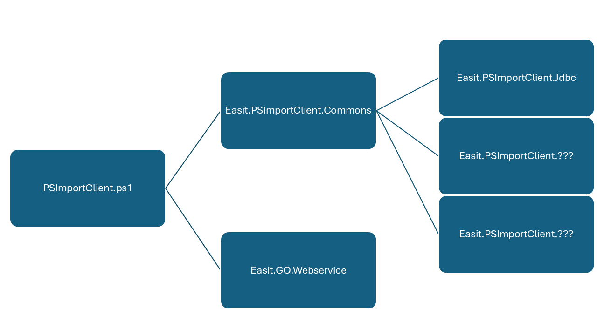

# PSImportClient

## General script flow

* Script start
  * Initiation process
    * Directory validations
    * Setting file validation
    * Import dependency modules
    * Creating runtime variables
  * Import configuration file(s)
  * For each configuration file:
    * For each destination
      * For each source
        * Read ImportClient configuration (either configured in Easit GO or a custom in *configuration.json*).
        * Collect objects from a source as configured.
        * Combine properties to new custom properties (if enabled and configured).
        * Compare objects from source with objects from destination (if enabled and configured).
        * Send objects to destination for update / create.
        * Update archive, if needed.
        * Run garbage collection.
  * Send notification with log file if error occurred and if enabled.
  * Run garbage collection.
  * Remove dependency modules
  * Remove runtime variables
* Script end

## Dependency model



## Dependency matris

|Package|Script / Module|Version|
|:---|:---|:---:|
|PSImportClient-1.0.0.zip|psImportClient.ps1|1.0.0|
||[Easit.PSImportClient.Commons](https://github.com/easitab/Easit.PSImportClient.Commons)|1.0.0|
||[Easit.GO.Webservice](https://github.com/easitab/Easit.GO.Webservice)|1.1.2|
||[Easit.PSImportClient.Jdbc](https://github.com/easitab/Easit.PSImportClient.Jdbc)|1.0.0|

## Supported sources

- CSV-file

## Local setup for development

1. Clone repo
2. Download / Save PS-module 'Easit.GO.Webservice' and 'Easit.PSImportClient.Commons' to src folder.
```pwsh
    Save-Module -Name 'Easit.GO.Webservice' -Path '[PathToRepo]\src'
    Save-Module -Name 'Easit.PSImportClient.Commons' -Path '[PathToRepo]\src'
```
3. Depending on what configuration type the ImportClient configuration is download / save the corresponding Easit.PSImportClient.* module.

## Further reading

All documentation for PSImportClient can be found at [techspace](https://docs.easitgo.com/techspace/easitgo/general/psimportclient/).
